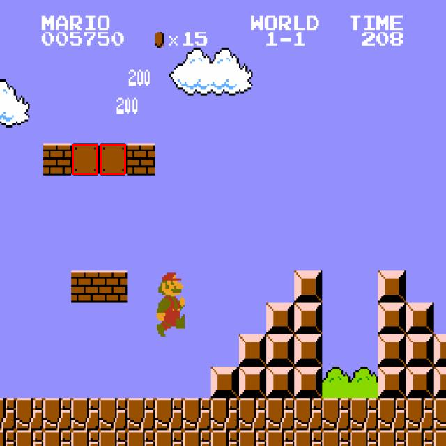

## Running a computer vision task on Raspberry Pi (C++)

Install OpenCV library:

```bash
sudo apt-get install libopencv-dev
```

With OpenCV installed, we can now preform all kinds of computer vision tasks. Clone this repo to your Pi.

```sh
mkdir ~/Project && cd ~/Project
git clone https://github.com/DengYuelin/object_detection_profiling.git
cd object_detection_profiling
```

### Template matching

#### Understanding the basics

In this section, we will learn the basics of template matching, and explore its time consumption when detecting multiple objects.

The base code is provided to you, try:

```sh
g++ -O3 src/template_matching_example.cpp -o tm_example `pkg-config --cflags --libs opencv4`
```

Run the compiled program

```sh
./tm_example examples/Source.jpg examples/templates/brick_block.png TM_CCOEFF_NORMED 0.9
```

You should see an output like:

```sh
2 objects detected using method TM_CCOEFF_NORMED with a threshold of 0.9
Result saved to runs/tm_result.png
```

If you open the figure (recommend coping it to your local system using [ssh](https://stackoverflow.com/questions/30553428/copying-files-from-server-to-local-computer-using-ssh)), you should see something like

<p align="center">
  
</p>

where detected objects are highlighted with red bounding boxes.

> **TASKS:**
>
> 1. Read through the code, explore using different template matching [methods](https://docs.opencv.org/3.4/df/dfb/group__imgproc__object.html#ga3a7850640f1fe1f58fe91a2d7583695d) and thresholds, also try detecting different [objects](examples/templates). Identify and report a [method + threshold] combination for each "block". (brick, empty, hard, and usdestructible block)
> 2. Based on your observations thus far, forecast how the execution time is affected by the number of objects depicted in the source figure. Additionally, predict on how the variety of object types to be identified might influence the total execution time.

#### WCET analysis of template matching

In this section, we will write code to preform template matching on [this](data/mario.mp4) video, and record the execution time of each frame.

The code framework if provide to you, try:

```sh
g++ -O3 src/template_matching.cpp -o template_matching `pkg-config --cflags --libs opencv4`
```

Run the compiled program

```sh
./template_matching
```

This source code iterate through each frame in the source video, and detect empty blocks. Your job is to modify the given source code , and complete the following tasks in order.

> **TASKS:**
>
> 1. Implement code to measure the execution time of each frame and store your data as a file. Plot the execution time statistically (histogram), temporally (frame_num v.s. time), and relative to object count (time v.s. objects detected). Include all three figures in your report.
> 2. Implement detection of all four types of blocks simultaneously. Record and plot the execution time again, how did it change? Include three new figures and your analysis.
> 3. What are the impact factors to the WCET of template matching of multiple objects you observed, does this match with your prediction in the previous section?

**NOTE:** Tweak the real-time scheduling parameters as discussed earlier, using the command of your choice to reduce system latency and jitter:

```sh
# Execute as a **normal** program with niceness settings
sudo nice -n $N ./template_matching # N is niceness ranging from 19 to -20 where -20 is the highest priority
# Execute as a real time program with priority settings
sudo chrt -r $N /template_matching # N is priority ranging from 1 to 99 where 99 is the highest priority
```

### Deploy a pre-trained YOLOv5 object recognition model

In this section we move on to object detection using DNN method. For your convenience, we pre-trained YOLOv5 using [this](https://universe.roboflow.com/baptiste-hustaix-znm0u/mario-ia-b8iuw/dataset/1) open source dataset. You can refer to [this](https://docs.ultralytics.com/yolov5/tutorials/train_custom_data) website to learn more.

Compile the source code and fix any errors that show up.

```sh
g++ -O3 src/yolo.cpp -o yolo_detection `pkg-config --cflags --libs opencv4`
```

Run the compiled inference program

```sh
./yolo_detection
```

#### Understanding the basics

> **TASKS:**
> Answer the following questions:
>
> 1. How many types of features can [this](network/yolov5s_mario.onnx) custom pre-trained network detect?
> 2. What is the difference between a ["small"](network/yolov5s_mario.onnx) model and a ["nano"](network/yolov5n_mario.onnx) model?
> 3. Read through the given code, what is the input and output of "Pre-process"? What about "Main Inference" and "Post-process"?
> 4. How do you interpret the output `output`? What can you do if you are only interested in the number and location of one type (class) of object?

#### WCET analysis of YOLO inference

Now that we understand how YOLO works, let's evaluate the WCET. Complete the following tasks in order and report your findings.

> **TASKS:**
>
> 1. Implement code to measure the **total** execution time of each frame and store as a file. Plot the execution time in both statistically (histogram), temporally (frame_num v.s. time), and relative to object count (time v.s. total objects detected).
> 2. Try to extract the numbers of each block detected, does the variation in interested types (classes) numbers affect the overall processing time? Compare this to the methodology of template matching.
> 3. Insert more timers inside the source code to identify the source of jitter during each step YOLO inference.
> 4. Try running the same task using a smaller model (network/yolov5n_mario.onnx), observe and report the differences.
> 5. Modify the code and run another video with time-varying scene complexity through the detection pipeline, remember to change the pre-trained network to standard YOLO `network/yolov5s.onnx`. An example is provided [here](data/party.mp4). Examine how the processing time of each frame changes over time. What is the overall distribution of these processing times?
> 6. Based on your experiment thus far, summarize the difference in WCET between template matching and YOLO, what are the advantages and disadvantages of each method?

**HINT:**

```cpp
// Get current time
tic = std::chrono::high_resolution_clock::now();
// Calculate clock difference
std::chrono::duration_cast<std::chrono::microseconds>(toc - tic).count();
// Write to file
std::ofstream yourfile("yourfile.txt", std::ofstream::out | std::ofstream::trunc);
yourfile << "String" << data;
yourfile.close();
```

## Other RTOS analysis on Raspberry Pi

Now let's explore the impact of running a real-time task on other processes.

> **TASKS:**
>
> 1. Try running the detection code with the highest priority and least niceness. Put your process into the background with an `&` (e.g. `./yolo_detection &`). Now you free up the foreground terminal to execute other tasks. Then `cyclictest` in the foreground as you have done earlier, but _use a default priority (20) and niceness (0)_. Does your `cyclictest` execute as expected? Change the priority and niceness settings of `cyclictest` and report what you find.
> 2. Report any _physical anomalies_ you observe on the Raspberry Pi when running the detection code with the highest priority and least niceness. Try to interpret why based on [the electrical schematics](https://datasheets.raspberrypi.com/rpi4/raspberry-pi-4-reduced-schematics.pdf) and forum discussions (Hint: it is related to how the OS services the GPIO pins).
