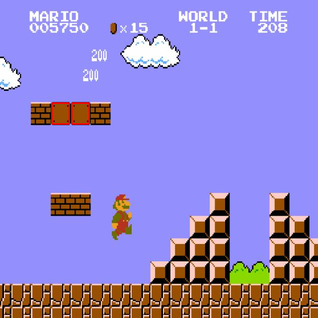

# Project: Profiling Object Detection Algorithms

In this project we will try to automate [Super Mario Brothers](https://en.wikipedia.org/wiki/Super_Mario_Bros.) game play by detecting blocks in the environment.

<p align="center">
  
</p>

Your task is to test two types of objection algorithms, namely [YOLOv5](https://github.com/ultralytics/yolov5) and [template matching](https://www.sciencedirect.com/topics/engineering/template-matching), and preform [WECT](https://en.wikipedia.org/wiki/Worst-case_execution_time) analysis on them. Most of the code will be provided to you, follow the steps in this document and complete all **TASKS**.

## Install RTOS on Raspberry Pi

Follow the instructions [here](/setup_instructions.md) to setup your Pi.

## Verify the PREEMPT_RT kernel on your Pi

1.  Verify that your custom-built kernel is loaded properly:

    ```bash
    uname -a
    ```

    You should see both your customized string and the `SMP PREEMPT_RT` string. For example,

    ```
    Linux raspberrypi 6.1.63-rt16-v8-RT+ #1 SMP PREEMPT_RT Tue Nov 28 21:23:27 GMT 2023 aarch64 GNU/Linux
    ```

    If you see:

    ```
    Linux raspberrypi 6.1.0-rpi4-rpi-v8 #1 SMP PREEMPT Debian 1:6.1.54-1+rpt2 (2023-10-05) aarch64 GNU/Linux
    ```

    it means the real-time kernel wasn't successfully patched.

2.  Assessment and comparison of latency and jitter under different real-time scheduling parameters. You need to install and run real-time testing utilities to test system latency:

    ```sh
    sudo apt install rt-tests
    ```

    Refer to [the official document](https://wiki.linuxfoundation.org/realtime/documentation/howto/tools/rt-tests) on what kind of tests you can perform and try them with different parameters.
    **HINT:** One option is to use [cyclictest](https://wiki.linuxfoundation.org/realtime/documentation/howto/tools/cyclictest/start):

    ```sh
    sudo cyclictest --help
    ```

    You can also change the priority of a process being run using:

    ```sh
    sudo chrt -r $YOUR_PRIORITY $YOUR_COMMAND
    ```

    and

    ```sh
    sudo nice -n $YOUR_NICENESS $YOUR_COMMAND
    ```

    The two commands can be cascaded. Refer to [the manual page of `chrt`](https://man7.org/linux/man-pages/man1/chrt.1.html), [and `nice`](https://man7.org/linux/man-pages/man1/nice.1.html) to see how that works.

    -   More on niceness vs. priority can refer to [this forum post](https://askubuntu.com/questions/656771/process-niceness-vs-priority).

    **NOTE:** When running the task over a `ssh` connection, a good practice is to use a terminal emulation tool (such as `screen`) to put your tasks to the local `stdout` buffer of the RTOS. This can prevent halts caused by output buffer filling up with an unstable connection [[Reference]](https://unix.stackexchange.com/questions/282973/do-programs-run-from-an-ssh-session-depend-on-the-connection).

3.  Compare back and forth (switch which kernel to load on boot by editing `/boot/firmware/config.txt`. The stock kernel should be `kernel8.img`). Compare your results.

> **TASKS:**
> How does a realtime kernel compare to standard ones? What scheduling algorithm are you running? Report on your findings.

## Running a computer vision task on Raspberry Pi

Install OpenCV, C++ version:

```bash
sudo apt-get install libopencv-dev
```

Alternatively, install OpenCV, Python version (not tested)

```bash
sudo apt-get install python3-opencv
# other used packages
sudo apt install python3-matplotlib
```

**NOTE:** Python version can also be installed with `pip`.

With OpenCV installed, we can now preform all kinds of computer vision tasks. Clone this repo to your Pi.

```sh
mkdir ~/Project && cd ~/Project
git clone https://github.com/DengYuelin/object_detection_profiling.git
cd object_detection_profiling
```

### Template matching (C++)

Skip to [this](#template-matching-python) section if you prefer to use Python.

TODO: under construction

### Template matching (Python)

We will first explore using template matching to detect multiple object of the same kind using template matching.

Try:

```sh
python scripts/template_matching_example.py examples/Source.jpg examples/templates/empty_block.png
```

You should see an output like:

```sh
2 objects detected using method TM_CCOEFF_NORMED with a threshold of 0.9
Result saved to runs/tm_result.png
```

If you open the figure (recommend coping it to your local system using [ssh](https://stackoverflow.com/questions/30553428/copying-files-from-server-to-local-computer-using-ssh)), you should see something like

<p align="center">
  
</p>

> **TASKS:**
>
> 1. Read through the code, explore using different template matching [methods](https://docs.opencv.org/3.4/df/dfb/group__imgproc__object.html#ga3a7850640f1fe1f58fe91a2d7583695d) and thresholds, also try detecting different [objects](examples/templates). Report on your findings.
> 2. Identify a [method + threshold] combination for each object. (brick, empty, hard, and usdestructible block)
> 3. Try detecting the location of Koopa using `examples/templates/koopa.png` as template in `examples/Source2.jpg`? What happens if you swith to `examples/Source3.jpg`? What are the potential problems in detecting objects like Koopa or Mario using template matching?

Now that we understand the basics of template matching, we can proceed to analysis its WCET.

Try:

```sh
python scripts/template_matching.py
```

The given script detect empty blocks in each frame of [this](data/mario.mp4) video.

Tweak the real-time scheduling parameters as discussed earlier, using `chrt` and `nice`:

```sh
# Execute as a **normal** program with niceness settings
sudo nice -n $N python scripts/template_matching.py # N is niceness ranging from 19 to -20 where -20 is the highest priority
# Execute as a real time program with priority settings
sudo chrt -r $N python scripts/template_matching.py # N is priority ranging from 1 to 99 where 99 is the highest priority
```

> **TASKS:**
>
> 1. Implement code to measure the execution time of each frame and store as a file. Plot the execution time in both statistically (histogram), temporally (frame_num v.s. time), and relative to object count (time v.s. objects detected).
> 2. Implement detection of all four types of blocks. HINT, simply imitate the given implementation. Plot the execution time again, how did it change?
> 3. Report what are the impact factors to the WCET of template matching of multiple objects.

### Deploy a pre-trained YOLOv5 object recognition model (C++)

Read [this](#deploy-a-pre-trained-yolo-v5-object-recognition-model-python) section first if you prefer to use Python.

Now we move on to object detection using DNN methods, for your convenience, we pre-trained YOLOv5 using [this](https://universe.roboflow.com/baptiste-hustaix-znm0u/mario-ia-b8iuw/dataset/1) open source dataset. You can refer to [this](https://docs.ultralytics.com/yolov5/tutorials/train_custom_data) website to learn more.

Compile the source code and fix any errors that show up.

```sh
g++ -O3 src/yolo.cpp -o yolo_detection `pkg-config --cflags --libs opencv4`
```

Run the compiled inference program

```sh
./yolo_detection # no additional information will be printed to terminal
```

Tweak the real-time scheduling parameters as discussed earlier, using `chrt` and `nice`:

```sh
# Execute as a **normal** program with niceness settings
sudo nice -n $N ./yolo_detection # N is niceness ranging from 19 to -20 where -20 is the highest priority
# Execute as a real time program with priority settings
sudo chrt -r $N ./yolo_detection # N is priority ranging from 1 to 99 where 99 is the highest priority
```

> **TASKS:**
>
> 1. Implement code to measure the **total** execution time of each frame and store as a file. Plot the execution time in both statistically (histogram), temporally (frame_num v.s. time), and relative to object count (time v.s. total objects detected).
> 2. Try to count the numbers of each block detected, how does this differ from template matching approach?
> 3. Insert more timers inside the source code to identify the source of jitter during each step YOLO inference.
> 4. Try running the same task using a smaller model (network/yolov5n_mario.onnx), observe and report the differences.
> 5. Observe line 87 in the C++ code: `float \*classes_scores = data + 5;`, or python TODO:. Explain why the `+ 5` is there.

**HINT:**

```cpp
// Get current time
tic = std::chrono::high_resolution_clock::now();
// Calculate clock difference
std::chrono::duration_cast<std::chrono::microseconds>(toc - tic).count();
// Write to file
std::ofstream yourfile("yourfile.txt", std::ofstream::out | std::ofstream::trunc);
yourfile << "String" << data;
yourfile.close();
```

### Deploy a pre-trained YOLOv5 object recognition model (Python)

Refer to `scripts/yolo.py` for the executable source code. The implementation uses the same onnx model as the C++ example for main inferrence, but adopts the official post-processing implementation for the raw network output. The post-processing implementation is included in `scripts/utils/general.py`.

Please refer back to the C++ section for instructions.

## Other detection analysis

1. Run another video with time-varying scene complexity through the detection pipeline, remember to change the pre-trained network. An example can be found [here](data/party.mp4). Examine how the processing time of each frame changes over time. What is the overall distribution of these processing times?

2. Run the same video over a contour analysis pipeline (Reference: https://docs.opencv.org/4.x/dd/d49/tutorial_py_contour_features.html) -- the student needs to write a code to extract contours and cluster them based on hierarchies, and analyze each cluster for specific objects (e.g. find all circles that represent tables, and all rectangles that represent humans. There is no unique solution to this part, but we want to show that the combinatorial search of features explodes the complexity).

3. Alternative to Step 5, the students can write a code for template matching using SIFT or ORB features. This also involves combinatorial search in KNN matching.
